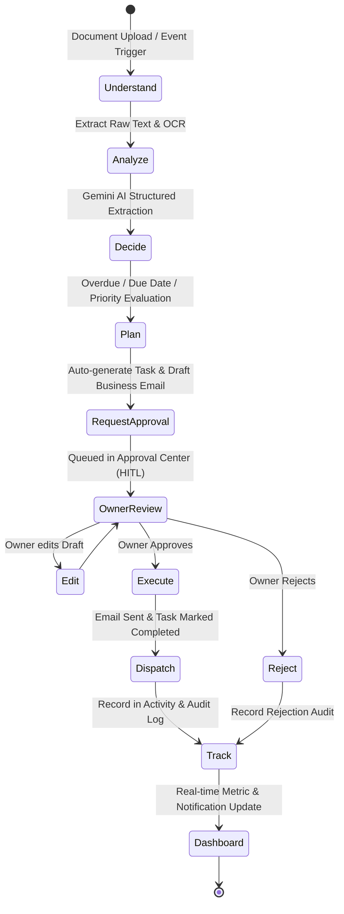

# System Architecture: AI Business Operations Agent

## 1. High-Level Architecture

The **AI Business Operations Agent** functions as an intelligent digital employee for Small and Medium Enterprises (SMEs). Rather than acting purely as a passive database viewer or conversational chatbot, it integrates an active multi-step reasoning workflow engine.

```
+-------------------------------------------------------------------------------+
|                             USER INTERACTION LAYER                            |
|          React.js + Vite + Tailwind CSS + Lucide Icons + Recharts             |
|  (Dashboard, AI Command Center, Documents, Invoices, Approvals, Email Studio) |
+---------------------------------------+---------------------------------------+
                                        |  REST APIs (JSON / JWT Auth)
                                        v
+-------------------------------------------------------------------------------+
|                              FASTAPI BACKEND                                  |
|  - Route Handlers (/api/auth, /api/dashboard, /api/documents, /api/approvals) |
|  - Authentication & JWT Middleware                                            |
|  - PyMuPDF / OCR Document Preprocessor                                        |
+-------------------+-------------------+-------------------+-------------------+
                    |                   |                   |
                    v                   v                   v
+-----------------------+ +-----------------------+ +---------------------------+
|    POSTGRESQL / ORM   | |   WORKFLOW ENGINE     | |   GOOGLE GEMINI AI        |
| - users, businesses   | | - Understand Intent   | | - gemini-1.5-flash        |
| - customers, invoices | | - Analyze Context     | | - Document Intelligence   |
| - documents, tasks    | | - Auto-Task Detection | | - Natural Language Q&A    |
| - approvals, emails   | | - Human-in-the-Loop   | | - Email Generator         |
| - activities, notifs  | | - Execution Engine    | | - Operational Briefs      |
+-----------------------+ +-----------------------+ +---------------------------+
```

---

## 2. Core Workflow State Machine: Understand -> Plan -> Approve -> Execute -> Track



---

## 3. Human-in-the-Loop (HITL) Guardrails

Sensitive financial and customer communication actions are never executed blindly. The system strictly adheres to:
1. **AI Suggests**: Extracts details, drafts formal responses, calculates exposure.
2. **Owner Reviews**: The business owner inspects the exact preview in the Approval Center.
3. **Owner Modifies**: Editable modal allows tone or balance adjustments before transmission.
4. **Autonomous Execution**: On approval, the backend records email dispatch and updates customer balances.
5. **Verifiable Audit**: Complete timeline entry in the activity log.
